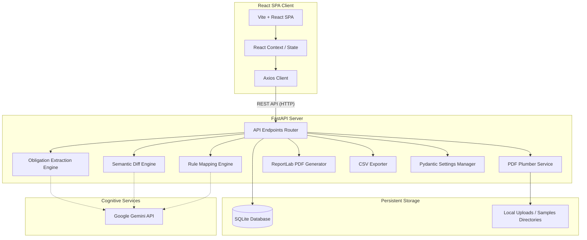
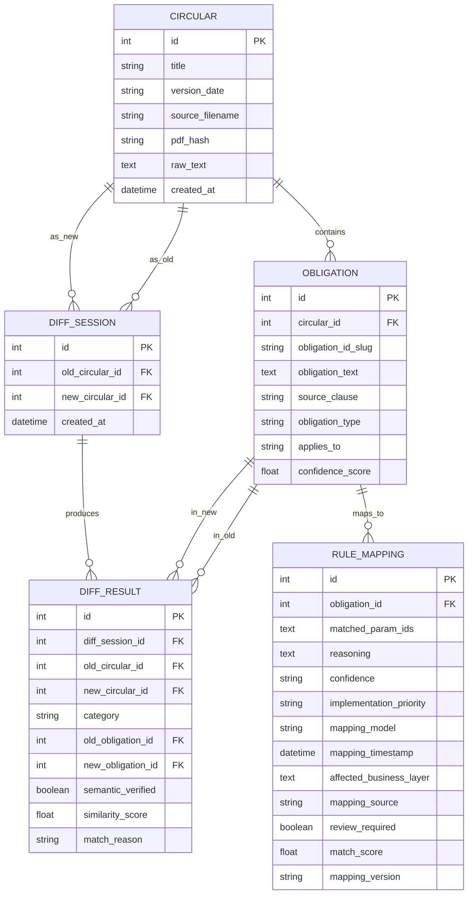

# RegPulse System Architecture

This document details the software architecture, data models, and system components of **RegPulse** — the Reserve Bank of India (RBI) Circular Impact Simulator.

## Component Overview

RegPulse is designed with a decoupled **Client-Server** architecture, mapping regulatory texts to bank operational parameters.

---

## Database Architecture (Schema)

RegPulse uses an SQLite database (`regpulse.db`) managed via SQLAlchemy 2.0 ORM. The relational schema is structured as follows:

### Table Definitions

1. **`circulars`**: Stores metadata, SHA-256 hashes, and raw extracted text of uploaded RBI circular PDFs.
2. **`obligations`**: Compliance obligations extracted from circular texts.
3. **`diff_sessions`**: Tracks comparison sessions between a baseline (old) and updated (new) circular.
4. **`diff_results`**: Links obligations between the circulars, categorizing them as `new`, `changed`, or `unchanged`.
5. **`rule_mappings`**: Configures how `new` and `changed` obligations align to the bank's operational parameters (Rule Taxonomy).

---

## Core Operational Modules

### 1. Extraction Pipeline (PDF -> Text -> Obligations)
Extracts human-readable text from uploaded PDFs using `pdfplumber`, applies text cleaning heuristics, and translates the raw text into structured compliance obligations using the Gemini API.

### 2. Semantic Diff Engine (SequenceMatcher + Gemini)
Determines updates between circulars. It utilizes a hybrid approach:
- Highly similar requirements ($\ge$ 90% character similarity) are categorized as `unchanged` immediately.
- Ambiguous matches (between 55% and 90% similarity) are sent to Gemini to evaluate semantics.
- Completely unmatched requirements are designated as `new`.

### 3. Rule Mapping Engine
Correlates obligations against the 13 bank parameters (e.g. `aml_txn_threshold`, `kyc_risk_weight`). It filters invalid parameters, identifies the affected business layers, and computes an automated implementation priority.
