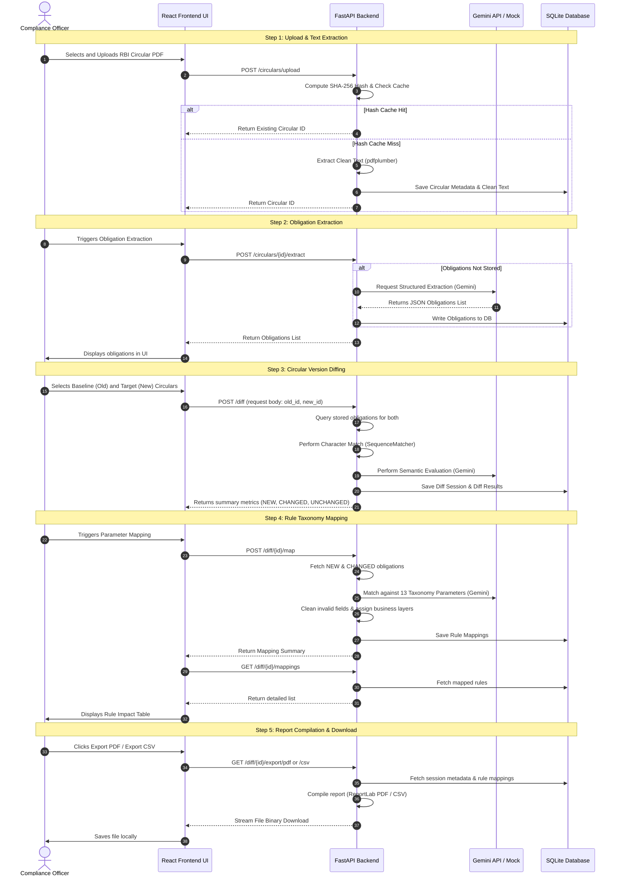

# RegPulse Operational Workflow

This document illustrates the end-to-end user workflow in RegPulse, showing how circulars progress from raw PDF uploads to the final advisory compliance report.

---

## The 5-Step Compliance Workflow

The diagram below outlines the sequential phases of the assessment process:

---

## Detailed Step Description

### Step 1: Upload & Text Extraction
1. The user uploads a PDF document (e.g. `KYC_Amendment_2020.pdf`) via the **Circular Library** page.
2. The backend computes the SHA-256 hash to verify if the file has been processed previously.
3. If it is a new file, the PDF's text is parsed with `pdfplumber`, stripping headers, footers, page numbers, and repeating boilerplates.

### Step 2: Obligation Extraction
1. Before a circular can be compared or mapped, its compliance obligations (specific rules, instructions, or permissions) are extracted.
2. The AI parses the text and produces structured rows including:
   - **Clause Source**: (e.g. `Section 3(a)`)
   - **Type**: `mandatory`, `permissive`, or `prohibitive`
   - **Applies to**: target entities (e.g. `all_banks`, `nbfcs`)
   - **Confidence Score**: evaluation metric

### Step 3: Circular Version Diffing
1. The user compares two circulars in the **Circular Comparison** module.
2. The comparison engine pairs obligations. It checks for literal match using a Python `SequenceMatcher` algorithm.
3. For obligations that fall into the grey zone ($\ge 55\%$ and $<90\%$ similarity), a semantic LLM verification check is invoked to understand if the difference is purely syntactic or represents a material policy adjustment.

### Step 4: Rule Taxonomy Mapping
1. For every modified obligation (classified as `new` or `changed`), the **Rule Mapping Engine** finds which parameters inside the bank's decision system must be adjusted.
2. The output provides a clear reasoning explanation, indicates the confidence level, and specifies if manual human-in-the-loop review is recommended.

### Step 5: Exporting Reports
1. The compliance officer reviews the summary dashboard.
2. The dashboard offers tools to print, download a professional PDF document containing compliance metrics, or export raw CSV tables to feed downstream corporate workflow systems.
